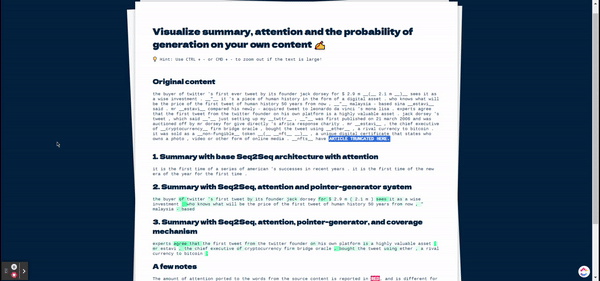

# A Playground for Pointer-Generator Networks with Coverge 👨‍🔬

An interactive demo for **"Get To The Point: Summarization with Pointer-Generator Networks"**, [available here](https://www.aclweb.org/anthology/P17-1099/) by Abigail See, Peter J Liu, and Christopher Manning.

I highly advise to experiment it with Google Colab as it provides a base working environment, and there are a few old dependencies.

This notebook is made in the context of the [Natural Language Processing](https://moodle.polytechnique.fr/course/view.php?id=10247) course with [Telecom Paris](https://www.telecom-paris.fr/), in IP Paris's Master for Data Science ⚔️

---

## Demo of the summary generation

## Disclaimer

This repository contains code from various sources, and its only purpose was to put together a small demo of what can bedone with **Pointer-Generator** networks, following the example of the excellent repos of [Abigail See](https://cs.stanford.edu/people/abisee/).

Sources: [Base network repo](https://github.com/abisee/pointer-generator), [visualizer starting code](https://github.com/abisee/attn_vis) and [datafiles generation for pgn](https://github.com/dondon2475848/make_datafiles_for_pgn).
